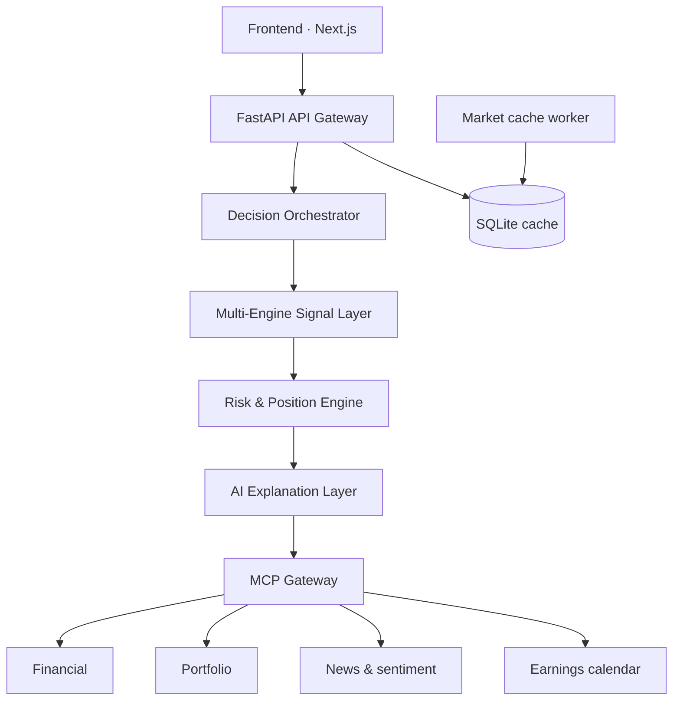

# XingAI System Overview

XingAI is an **AI-powered investment decision system** — not a broker, not a price charting tool, and not a promise of returns. The flagship product is **XingAI Invest AI** (decision dashboard + API). **InvestSim** is a separate paper-trading lab that consumes Invest AI signals under fixed rules for simulation only.

**Product upgrade rule:** see workspace [`AGENTS.md`](../../AGENTS.md) → *Product Upgrade Rule* (includes Meal/Cook/Invest examples).

---

## Architecture

```text
Frontend (Next.js)
→ FastAPI API Gateway
→ Decision Orchestrator
→ Multi-Engine Signal Layer
→ Risk & Position Engine
→ AI Explanation Layer
→ MCP Gateway
```

| Layer | Role (today / target) |
|-------|------------------------|
| **Frontend (Next.js)** | `stock-ai-front-end` — dashboard, decision board, SSE streaming, bilingual UX |
| **FastAPI API Gateway** | `stock-ai-back-end` — `/api/v1` (quotes, portfolio, analysis) and `/api/v2` (regime, consensus, signals) |
| **Decision Orchestrator** | Combines engine scores, consensus weights, and regime into a single decision context |
| **Multi-Engine Signal Layer** | Independent scorers (trend, momentum, volatility, regime, breadth, etc.) on cached market data |
| **Risk & Position Engine** | Risk level, position-size bands, concentration and drawdown guardrails |
| **AI Explanation Layer** | Structured brief (Gemini) + reasoning narrative (OpenAI); optional local Ollama in dev |
| **MCP Gateway** | **V3 target** — unified access to market, portfolio, news, calendar, and (phased) broker tools |

**Supporting services (monorepo):**

- **stock-ai-worker** — warms SQLite caches (indices, active stocks, ETFs) from Yahoo Finance on a timer  
- **stock-ai-monitor** — ops control plane (health, logs, start/stop)  
- **InvestSim** (satellite) — paper ledger simulation; calls Invest AI over HTTPS only  



---

## Engines

Independent engines score the market on a **0–100** scale. Scores are computed from **cache-first** inputs (SPY, QQQ, IWM, DIA, VIX, TNX, volume participation) so the API stays fast and cheap.

| Engine | What it measures |
|--------|------------------|
| **Trend Engine** | Multi-timeframe price trend (e.g. 1D / 5D / 20D on SPY & QQQ) |
| **Momentum Engine** | Short-term tape and QQQ trend blend |
| **Volatility Engine** | VIX-implied stress (lower vol → higher score) |
| **Macro Regime Engine** | Blends trend, volatility, and rate pressure (TNX) into risk-on / neutral / risk-off |
| **Market Breadth Engine** | Participation across major index ETFs (SPY, QQQ, IWM, DIA) |
| **Institutional Flow Engine** *(V2)* | Trend, breadth, and volume participation proxy |
| **Confidence Engine** *(V2)* | Agreement across engine scores → consensus strength |

Engines do **not** vote in isolation forever — the orchestrator applies **regime-aware weights** (e.g. emphasize volatility and breadth in choppy markets).

---

## Data Sources

| Category | Examples |
|----------|----------|
| **Market data (OHLCV, ETF, VIX, TNX)** | Yahoo Finance / yfinance → SQLite cache; indices (DJI, NASDAQ, S&P 500); liquid ETFs; VIX, 10Y yield |
| **Portfolio data (positions, cost)** | User holdings, cost basis, weights, cash — Supabase settings + portfolio APIs; **Portfolio MCP** in V3 |
| **News & sentiment** | News APIs, filings context, sentiment — V2 Finnhub path; **News MCP** in V3 |
| **Earnings calendar** | Upcoming earnings, macro dates (FOMC, CPI), ex-dividends — **Calendar MCP** in V3 |

Raw bulk ingestion is compressed in the **AI Explanation Layer** (Gemini `MarketBrief`) before deep reasoning (OpenAI `DecisionResult`) to control cost and latency.

---

## Decision Output

Structured fields exposed to the UI and downstream consumers (e.g. InvestSim ingest):

| Field | Description |
|-------|-------------|
| **Action** | Buy / Sell / Hold (and regime labels such as Risk-On, Neutral, Risk-Off) |
| **Position Size** | Suggested allocation band from consensus score and risk posture |
| **Risk Level** | Low / Moderate / High from score + VIX context |
| **Confidence Score** | Engine agreement and calibrated confidence % |

Optional narrative: streamed or cached **rationale** (why this action, what disagrees, what to watch).

---

## Philosophy

- **Risk-first** — regime, volatility, and position limits before chasing return  
- **Probability over prediction** — scores and consensus, not “this stock will go up”  
- **Systematic decision-making** — repeatable engines + orchestration, human-readable explanations  

**Legal posture:** All user-facing surfaces pair product copy with disclaimers — not investment advice, not a broker. Execution (broker MCP) is **phased** and never the V1 story.

---

## Roadmap alignment

| Phase | Focus |
|-------|--------|
| **V1** | Dashboard, cache worker, LLM analysis, free beta — **no execution** |
| **V2** | Hybrid LLM pipeline, multi-engine consensus, decision API — **implemented in production path** |
| **V3** | MCP Gateway (financial → news → calendar → portfolio → broker paper/live) |
| **V4** | Paid workflows — still decision-first, not “guaranteed picks” |

---

## References

- Repo: `xingai-invest-ai/` — README, ADR-001 (three-layer AI), ADR-003 (MCP phased rollout)  
- Satellite: `invest-performance-sim/` — AI Paper Trading Lab  
- Brand: [xingai.app](https://xingai.app)
