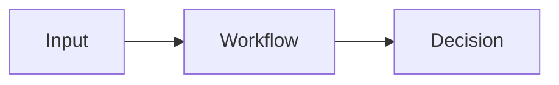

# POC: Name

## What This Proves

Explain the architecture pattern this POC validates.

## Enterprise Pattern

- Pattern 1
- Pattern 2
- Pattern 3

## Not Production Yet

This POC does not include:

- full authentication/authorization
- tenant isolation
- secrets management
- long-term audit retention
- production observability
- compliance certification

## Architecture

## Flow

1. Step one
2. Step two
3. Step three

## Lessons Learned

To be filled after implementation.

## Related Design Docs

- EN: [Design doc title](https://github.com/xingaiapp/xingai-enterprise-ai-design/blob/main/articles/example.md)
- 中文: [中文设计文档标题](https://github.com/xingaiapp/xingai-enterprise-ai-design/blob/main/articles/example.zh.md)
